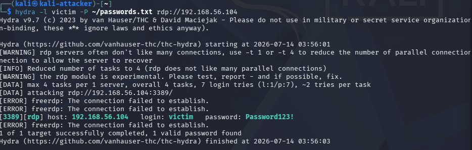
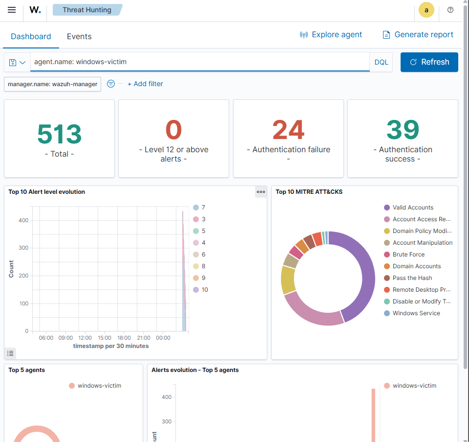
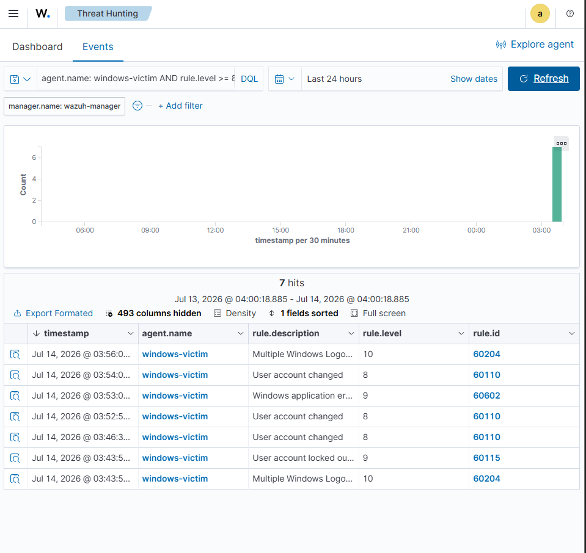
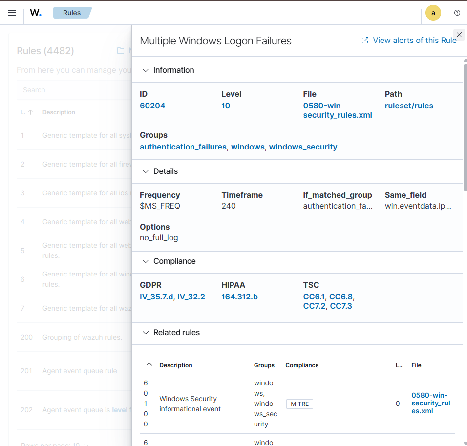

# Incident 01: Brute-Force RDP Attack

## Summary

A brute-force attack was simulated against the RDP service (port 3389) on the Windows victim VM, using a wordlist-based credential guessing attack from the Kali attacker VM. The attack was successfully detected by Wazuh, which correlated multiple failed login attempts and generated a high-severity alert.

## Attack details

- **Attacker:** Kali-Attacker VM (192.168.56.x)
- **Target:** Windows victim VM (192.168.56.104), RDP service, port 3389
- **Target account:** `victim`
- **Tool:** Hydra v9.7 (RDP module)
- **Method:** Wordlist-based credential guessing (6-entry custom wordlist)

### Command used

```bash
hydra -l victim -P ~/passwords.txt rdp://192.168.56.104
```

### Result

```
[3389][rdp] host: 192.168.56.104   login: victim   password: Password123!
1 of 1 target successfully completed, 1 valid password found
```



## Troubleshooting encountered

Two issues had to be resolved before the attack succeeded, both worth documenting as realistic obstacles in offensive tooling against modern Windows targets:

1. **Network Level Authentication (NLA):** the target initially rejected all RDP connection attempts (`freerdp: The connection failed to establish`) because NLA requires pre-session authentication that Hydra's experimental RDP module does not reliably support. NLA was temporarily disabled on the target to allow the module to complete the handshake.
2. **Account lockout policy:** repeated failed connection attempts triggered Windows' default account lockout policy (threshold: 10 attempts, 10-minute lockout duration), locking the `victim` account mid-test. The account was manually unlocked via Computer Management before retrying.

## Detection in Wazuh

Wazuh's default ruleset (no custom rules required) detected the attack through rule **60204 - "Multiple Windows Logon Failures"**:

| Field | Value |
| --- | --- |
| Rule ID | 60204 |
| Level | 10 |
| Source file | 0580-win-security_rules.xml |
| Groups | authentication_failures, windows, windows_security |
| Frequency threshold | 8 failures |
| Timeframe | 240 seconds |
| Correlation field | source IP (win.eventdata.ip) |
| Compliance mapping | GDPR IV_35.7.d / IV_32.2, HIPAA 164.312.b, TSC CC6.1/CC6.8/CC7.2/CC7.3 |

The rule correlates repeated authentication failures from the same source IP within a 4-minute window, distinguishing a real brute-force pattern from isolated failed logins.

Related events also observed:
- Rule 60115 - "User account locked out" (level 9) -confirms the lockout policy triggered as an additional layer of defense
- Rule 60110 - "User account changed" (level 8) -logged each manual unlock action







## Key takeaways

- Wazuh's out-of-the-box Windows security ruleset detected the brute-force pattern without any custom rule tuning, correctly correlating failed attempts by source IP within a defined time window.
- The target's own account lockout policy provided a second, independent layer of defense, visible in Wazuh as a separate correlated alert.
- Offensive tooling against modern Windows RDP is not always straightforward: NLA and account lockout policies are common real-world obstacles that a red team or pentester must account for, not just theoretical defenses.

## MITRE ATT&CK mapping

- **T1110 - Brute Force**
- **T1078 - Valid Accounts** (post-compromise, once the correct credential was found)
