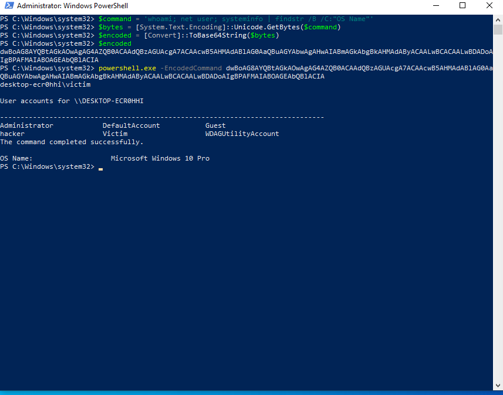
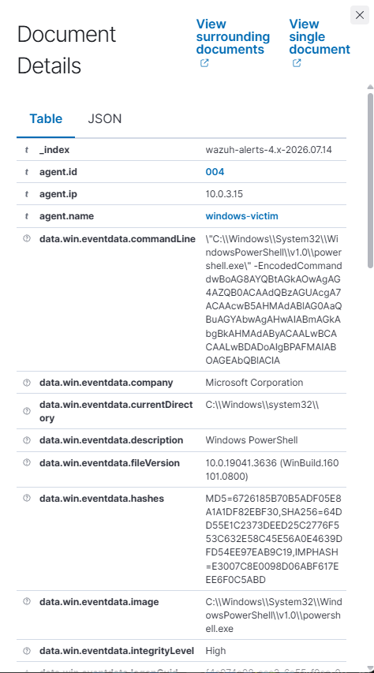
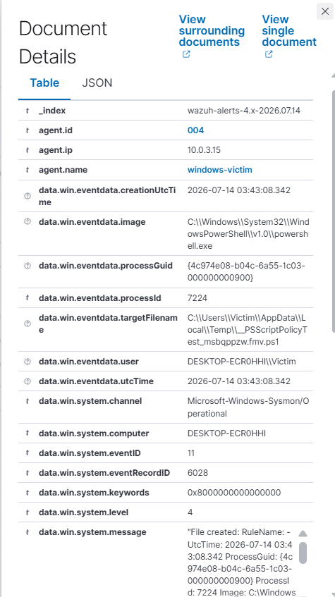
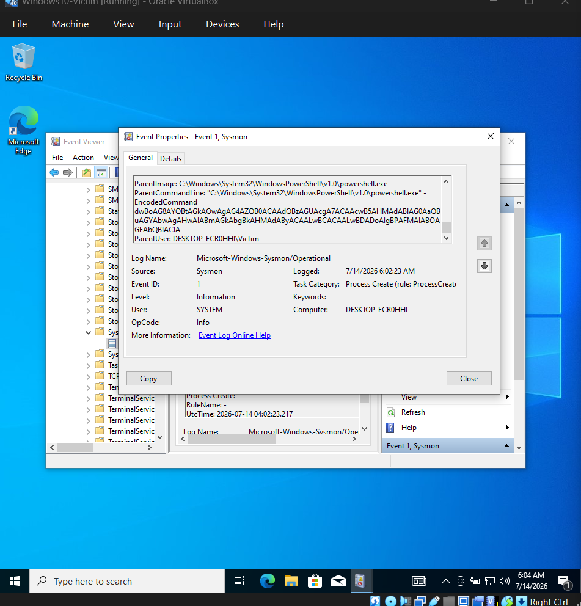

# Incident 03: Obfuscated (Base64-Encoded) PowerShell Execution

## Summary

A Base64-encoded PowerShell command was executed on the Windows victim VM through the compromised RDP session, simulating a common attacker obfuscation technique used to evade simple keyword-based detection. Wazuh, once properly configured to ingest the Sysmon event channel, detected the activity through multiple correlated indicators, including the encoded command itself, PowerShell process spawning behavior, and a known PowerShell script-policy forensic artifact.

## Attack details

- **Attacker access:** RDP session as `hacker` (account created in Incident 02)
- **Target:** Windows victim VM
- **Technique:** MITRE ATT&CK T1027 (Obfuscated Files or Information) combined with T1059.001 (PowerShell) and T1082/T1087 (System/Account Discovery)

### Building the encoded command

The payload (a basic reconnaissance command chain) was encoded manually to demonstrate the process an attacker's tooling automates:

```powershell
$command = 'whoami; net user; systeminfo | findstr /B /C:"OS Name"'
$bytes = [System.Text.Encoding]::Unicode.GetBytes($command)
$encoded = [Convert]::ToBase64String($bytes)
```

PowerShell's `-EncodedCommand` flag requires UTF-16LE-encoded bytes converted to Base64 - this is not encryption, only obfuscation: the flag itself remains visible in the process command line even though the payload content is not human-readable.

### Execution

```powershell
powershell.exe -EncodedCommand dwBoAG8AYQBtAGkAOwAgAG4AZQB0ACAAdQBzAGUAcgA7ACAAcwB5AHMAdABlAG0AaQBuAGYAbwAgAHwAIABmAGkAbgBkAHMAdAByACAALwBCACAALwBDADoAIgBPAFMAIABOAGEAbQBlACIA
```

The decoded command returned the current user, a full local account listing, and the OS name - a typical post-compromise discovery step.



## Troubleshooting encountered

Detecting this incident required resolving a gap in the lab's telemetry pipeline, which is documented here as it reflects a realistic SOC troubleshooting scenario:

1. **VM clock desync:** the Windows victim VM's clock drifted out of sync after a host restart (VirtualBox Guest Additions time sync depends on host clock/timezone accuracy). This caused Sysmon events to be logged with incorrect timestamps, making them invisible to time-scoped Wazuh searches. Resolved by correcting the host's timezone and restarting the VM to force a clean re-sync.
2. **Wazuh agent duplicate registration:** after the VM restart, the agent's local credentials became invalid, causing it to attempt a fresh enrollment under the host's default hostname (`DESKTOP-ECR0HHI`) instead of the intended agent name. The manager rejected this due to a leftover duplicate registration. Resolved by removing all stale agent entries via `manage_agents` on the Wazuh server and re-enrolling explicitly with `agent-auth.exe -A windows-victim`.
3. **Missing Sysmon event channel in agent config:** the root cause of the missing detections. The Wazuh agent's `ossec.conf` did not include the Sysmon Operational event channel by default, so process-creation telemetry (Sysmon Event ID 1) was generated locally but never forwarded to the manager. This was fixed by adding:

```xml
<localfile>
  <location>Microsoft-Windows-Sysmon/Operational</location>
  <log_format>eventchannel</log_format>
</localfile>
```

   to `ossec.conf`, followed by a Wazuh agent service restart. This single configuration gap had also silently affected the completeness of Incidents 01 and 02 (any Sysmon-only telemetry for those incidents was similarly missing until this fix).

## Detection in Wazuh

Once the Sysmon channel was correctly ingested, several correlated alerts confirmed the attack:

| Rule ID | Level | Description |
| --- | --- | --- |
| 92057 | 12 | PowerShell.exe spawned a child process |
| 92213 | 15 | Executable file dropped / suspicious script-policy artifact created |
| 92031 / 92033 | 3 | Discovery activity executed / spawned |
| 92039 | 3 | `net.exe` account discovery |

The rule 92057 alert captured the full `-EncodedCommand` flag and its Base64 payload directly in `data.win.eventdata.commandLine`, proving that the flag itself is a reliable detection point regardless of payload obfuscation.



The highest-severity alert (rule 92213, level 15) corresponded to a Sysmon Event ID 11 (File Create) for a file named `__PSScriptPolicyTest_msbqppzw.fmv.ps1` in the user's Temp directory. This is a known Windows PowerShell script-policy artifact automatically generated when an encoded or unusual PowerShell command is evaluated - a useful forensic indicator even when the command content itself is not directly visible.





## Key takeaways

- Base64 encoding obfuscates the *payload* but not the *flag* (`-EncodedCommand`) - this remains fully visible in process telemetry, so keyword-based detection on the flag itself is still effective.
- This incident depended entirely on Sysmon telemetry, unlike Incidents 01 and 02 which were detectable through standard Windows Security event logs. This highlights why explicitly configuring all relevant event channels in `ossec.conf` is a critical SIEM deployment step, not an optional extra - an incomplete configuration silently produces false negatives without any visible error.
- The `__PSScriptPolicyTest` artifact in Temp is a valuable secondary indicator: even if a future obfuscation technique hides the `-EncodedCommand` flag itself, this file-system-level artifact would still provide a detection opportunity.

## MITRE ATT&CK mapping

- **T1027 - Obfuscated Files or Information**
- **T1059.001 - Command and Scripting Interpreter: PowerShell**
- **T1082 - System Information Discovery**
- **T1087 - Account Discovery**